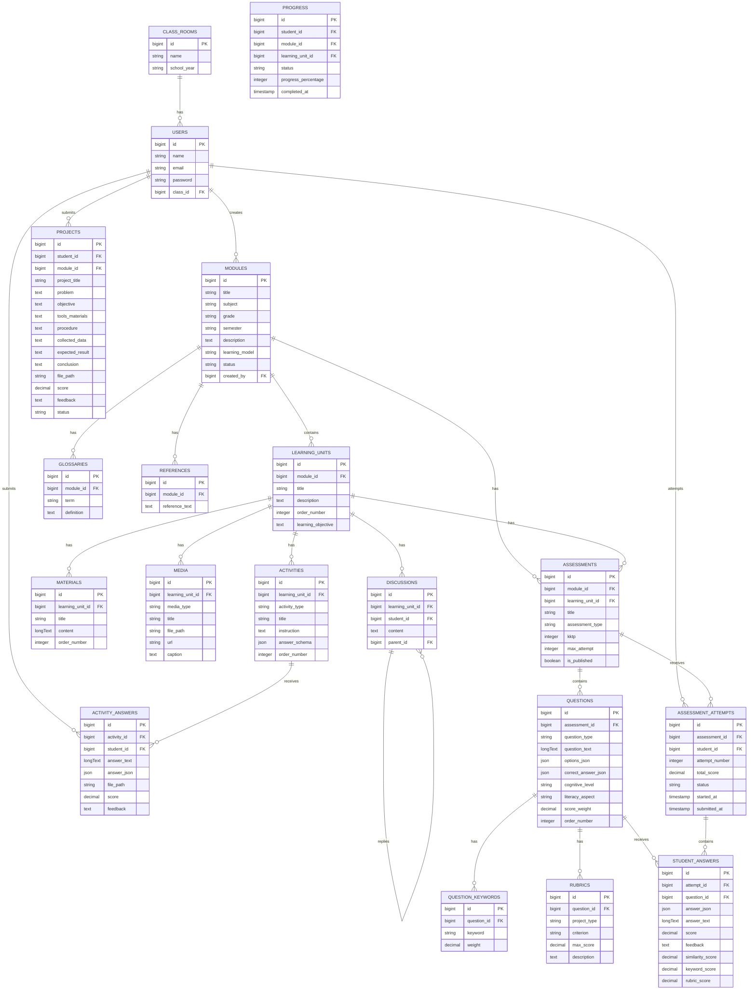

# ERD

Dokumen ini berisi rancangan ERD konseptual. Diagram menggunakan Mermaid agar dapat dibaca di Obsidian dengan plugin Mermaid bawaan.

## ERD Konseptual

## Catatan Normalisasi

- `questions.options_json` dipakai agar opsi bisa fleksibel untuk pilihan ganda, kompleks, dan menjodohkan.
- `questions.correct_answer_json` dipakai agar kunci jawaban bisa menyimpan struktur array/object.
- `student_answers` memisahkan skor akhir, keyword score, rubric score, dan similarity score agar scoring transparan.
- `rubrics` dibuat bisa nullable ke question agar dapat dipakai juga untuk proyek.

## Risiko Desain

- JSON memudahkan fleksibilitas, tetapi validasi harus kuat.
- Laporan bisa lambat jika query progress tidak dioptimalkan.
- Soft delete perlu dipertimbangkan untuk data modul dan asesmen agar riwayat murid tidak hilang.
