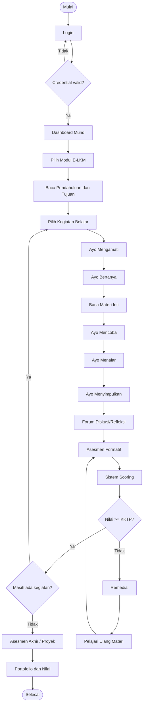
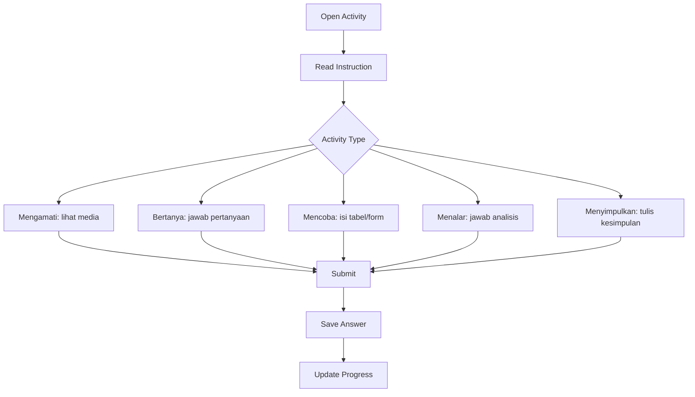
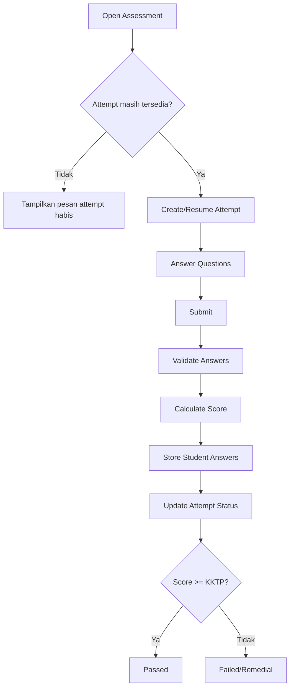

# Flow User Murid

Dokumen ini menjelaskan alur utama murid dari login sampai menyelesaikan modul.

## Flow Utama



## State Progress Murid

| Status | Arti |
|---|---|
| not_started | Murid belum membuka kegiatan |
| in_progress | Murid sedang mengerjakan kegiatan |
| completed | Murid selesai kegiatan dan tuntas |
| remedial | Murid belum memenuhi KKTP |
| locked | Kegiatan belum bisa diakses |

## Aturan Unlock Kegiatan Belajar

Aturan default:

```text
Kegiatan Belajar N+1 terbuka jika:
- Kegiatan Belajar N selesai
- Asesmen formatif N tuntas
```

Aturan opsional:

```text
Guru dapat mengatur apakah kegiatan terbuka bebas atau berurutan.
```

## Flow Aktivitas



## Flow Asesmen



## UX Requirement untuk Murid

- Instruksi harus singkat dan jelas.
- Progress per kegiatan harus terlihat.
- Nilai dan feedback harus mudah dibaca.
- Tombol lanjut hanya aktif jika aturan terpenuhi.
- Status remedial harus menjelaskan apa yang perlu dipelajari ulang.

## Risiko Flow

- Murid bingung jika semua menu terbuka sekaligus.
- Murid bisa skip materi jika unlock tidak diatur.
- Murid bisa submit jawaban kosong jika validasi lemah.
- Murid bisa kehilangan jawaban jika tidak ada autosave atau draft.
