# Use Case

## Aktor

- Admin
- Guru
- Murid

## Use Case Diagram

```mermaid
flowchart LR
    Admin([Admin])
    Guru([Guru])
    Murid([Murid])

    UCLogin((Login))
    UCLogout((Logout))

    UCManageUsers((Kelola Pengguna))
    UCManageClass((Kelola Kelas))
    UCManageRoles((Kelola Role))
    UCSystemReport((Lihat Laporan Sistem))

    UCManageModule((Kelola Modul))
    UCManageUnit((Kelola Kegiatan Belajar))
    UCManageMaterial((Kelola Materi dan Media))
    UCManageActivity((Kelola Aktivitas E-LKM))
    UCManageAssessment((Kelola Asesmen))
    UCManageRubric((Kelola Rubrik dan Keyword))
    UCReviewAnswer((Review Jawaban Murid))
    UCScoreProject((Nilai Proyek))
    UCClassReport((Lihat Laporan Kelas))

    UCOpenModule((Buka Modul))
    UCReadMaterial((Baca Materi))
    UCSubmitActivity((Isi Aktivitas))
    UCForum((Ikuti Forum))
    UCAttemptAssessment((Kerjakan Asesmen))
    UCViewScore((Lihat Nilai))
    UCRemedial((Ikuti Remedial))
    UCSubmitProject((Kirim Proyek))
    UCPortfolio((Lihat Portofolio))

    Admin --> UCLogin
    Guru --> UCLogin
    Murid --> UCLogin

    Admin --> UCManageUsers
    Admin --> UCManageClass
    Admin --> UCManageRoles
    Admin --> UCSystemReport
    Admin --> UCLogout

    Guru --> UCManageModule
    Guru --> UCManageUnit
    Guru --> UCManageMaterial
    Guru --> UCManageActivity
    Guru --> UCManageAssessment
    Guru --> UCManageRubric
    Guru --> UCReviewAnswer
    Guru --> UCScoreProject
    Guru --> UCClassReport
    Guru --> UCLogout

    Murid --> UCOpenModule
    Murid --> UCReadMaterial
    Murid --> UCSubmitActivity
    Murid --> UCForum
    Murid --> UCAttemptAssessment
    Murid --> UCViewScore
    Murid --> UCRemedial
    Murid --> UCSubmitProject
    Murid --> UCPortfolio
    Murid --> UCLogout
```

## Use Case Detail

### UC-001 Login

Aktor: Admin, Guru, Murid

Precondition:

- User sudah terdaftar.

Main Flow:

1. User membuka halaman login.
2. User memasukkan email dan password.
3. Sistem memvalidasi credential.
4. Sistem mengarahkan user ke dashboard sesuai role.

Exception:

- Credential salah.
- User tidak memiliki role.
- Akun nonaktif.

### UC-002 Kelola Modul

Aktor: Guru

Precondition:

- Guru sudah login.

Main Flow:

1. Guru membuka menu Modul Pembelajaran.
2. Guru membuat modul baru.
3. Guru mengisi metadata modul.
4. Guru menyimpan modul.
5. Sistem menyimpan data sebagai draft.

Acceptance:

- Modul tersimpan.
- Modul belum tampil ke murid sampai dipublish.

### UC-003 Mengikuti Aktivitas E-LKM

Aktor: Murid

Precondition:

- Murid sudah login.
- Modul sudah published.
- Aktivitas tersedia.

Main Flow:

1. Murid membuka kegiatan belajar.
2. Murid membaca instruksi aktivitas.
3. Murid mengisi jawaban.
4. Murid submit jawaban.
5. Sistem menyimpan jawaban dan memperbarui progress.

Exception:

- Jawaban kosong.
- Aktivitas belum aktif.
- Murid bukan bagian dari kelas/modul.

### UC-004 Mengerjakan Asesmen

Aktor: Murid

Main Flow:

1. Murid membuka asesmen.
2. Sistem membuat attempt baru.
3. Murid menjawab soal.
4. Murid submit.
5. Sistem menjalankan scoring.
6. Sistem menampilkan nilai dan status ketuntasan.

Exception:

- Attempt sudah melebihi batas.
- Asesmen belum published.
- Koneksi terputus saat submit.

### UC-005 Remedial

Aktor: Murid

Main Flow:

1. Sistem mendeteksi nilai kurang dari KKTP.
2. Sistem memberi status remedial.
3. Murid diarahkan mempelajari ulang bagian terkait.
4. Murid mengerjakan attempt berikutnya.
5. Sistem menghitung nilai ulang.

### UC-006 Nilai Proyek

Aktor: Guru

Main Flow:

1. Guru membuka daftar proyek murid.
2. Guru membaca rancangan dan bukti proyek.
3. Guru memberi skor berdasarkan rubrik.
4. Guru memberi feedback.
5. Sistem menyimpan nilai proyek.
