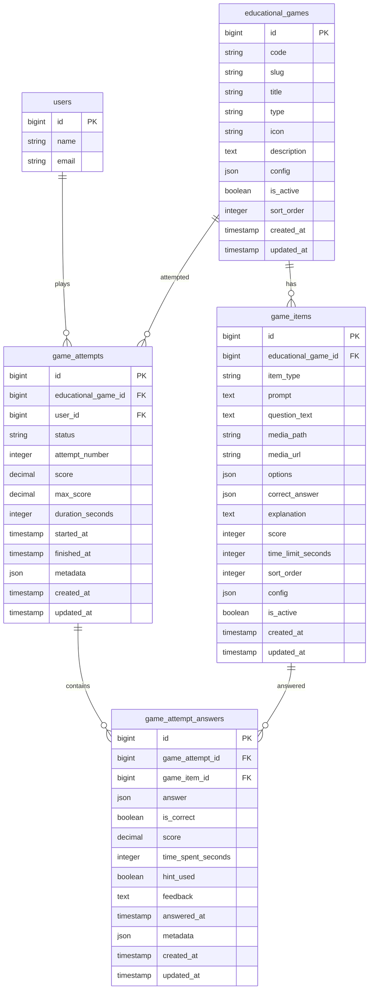

Saya sudah analisa dari sisi **flow product**, **SRS**, dan **desain ERD** untuk fitur **Games**. Posisi terbaiknya: fitur ini jangan dicampur ke `activities` atau `assessments`, tetapi dibuat sebagai **modul gamification tersendiri** yang tetap memakai fondasi project sekarang: Laravel 13, Livewire 4, Tailwind, MySQL, dan Spatie Permission. Repo Bapak saat ini memang sudah berbasis Laravel Livewire Starter Kit dengan package `spatie/laravel-permission`, `barryvdh/laravel-dompdf`, `maatwebsite/excel`, dan Livewire/Flux. ([GitHub][1]) Struktur role juga sudah ada pada route `admin`, `guru`, dan `murid`, tetapi belum ada route `games`; route murid saat ini baru mencakup dashboard, modul, kegiatan belajar, aktivitas, asesmen, remedial, proyek, nilai, dan portofolio. ([GitHub][2])

Fitur Games ini tetap selaras dengan konsep awal E-LKM karena sistem memang dirancang untuk pembelajaran digital yang interaktif, terstruktur, dan terukur, dengan role admin/guru/murid, laporan progres, nilai, dan aktivitas siswa yang tersimpan.  Selain itu, bahan ajar E-LKM menargetkan murid mampu memahami potensi energi, membedakan energi terbarukan, memakai data sederhana, merancang aksi energi terbarukan, dan mengomunikasikan hasil pembelajaran; empat game yang Bapak tampilkan masih berada dalam konteks tujuan tersebut.

## 1. Kesimpulan Arsitektur Fitur Games

Fitur **Games** sebaiknya dibuat sebagai **Game Engine berbasis data**, bukan 4 halaman hardcode yang berdiri sendiri.

Artinya:

```text
educational_games
    └── game_items
            └── game_attempt_answers
game_attempts
```

Dengan pola ini, empat game dapat memakai engine yang sama:

1. **Puzzle Alur Panel Surya**
2. **Kuis Cepat Energi**
3. **Misi Penyelamatan Bumi**
4. **Tebak Gambar Energi**

Keuntungannya: kalau nanti Bapak ingin menambah game kelima, misalnya “Simulasi Audit Energi Kelas”, tidak perlu rombak database besar. Cukup tambah data game baru dan komponen Livewire renderer baru bila tipe game belum didukung.

## 2. Flow Utama Fitur Games

Flow siswa:

```text
Siswa login
    ↓
Masuk Dashboard Murid
    ↓
Klik sidebar menu "Games"
    ↓
Sistem menampilkan 4 kartu game
    ↓
Siswa memilih game
    ↓
Sistem membuat game_attempt baru
    ↓
Siswa bermain
    ↓
Setiap jawaban/aksi disimpan ke game_attempt_answers
    ↓
Sistem menghitung skor
    ↓
Sistem menyelesaikan game_attempt
    ↓
Siswa melihat hasil akhir
    ↓
Guru dapat melihat rekap hasil game per siswa
```

Secara teknis, fitur ini wajib berada di middleware:

```php
Route::middleware(['auth', 'verified', 'role:murid'])
```

Jadi hanya siswa login dengan role `murid` yang dapat mengakses game. Guru/admin cukup mendapatkan akses laporan, bukan bermain sebagai siswa.

## 3. Flow Per Game

### A. Puzzle Alur Panel Surya

Dari screenshot, siswa menyeret komponen PLTS ke urutan benar. Komponen yang muncul: **Panel Surya**, **Baterai Opsional**, **Inverter**, dan **Rumah/Beban Listrik**.

Flow teknis:

```text
Start game
    ↓
Load komponen secara acak
    ↓
Siswa drag & drop ke area Urutan Kamu
    ↓
Klik Periksa Urutan
    ↓
Sistem bandingkan urutan siswa dengan correct_order
    ↓
Hitung skor
    ↓
Simpan hasil ke game_attempt_answers
    ↓
Tampilkan benar/salah + fakta menarik
```

Catatan penting: karena baterai bersifat opsional, engine harus mendukung lebih dari satu jawaban benar. Contoh:

```json
{
  "accepted_orders": [
    ["panel_surya", "inverter", "beban_listrik"],
    ["panel_surya", "baterai", "inverter", "beban_listrik"]
  ]
}
```

### B. Kuis Cepat Energi

Dari screenshot, formatnya 10 pertanyaan, timer 10 detik per soal, skor berjalan.

Flow teknis:

```text
Start attempt
    ↓
Load 10 soal
    ↓
Tampilkan soal 1 + timer 10 detik
    ↓
Siswa pilih jawaban
    ↓
Sistem simpan jawaban, waktu, benar/salah
    ↓
Lanjut soal berikutnya
    ↓
Setelah soal ke-10 selesai
    ↓
Hitung total skor
    ↓
Tampilkan hasil
```

Business rule:

```text
Benar sebelum waktu habis = skor penuh
Salah = 0
Tidak menjawab sampai waktu habis = 0 dan status timed_out
```

### C. Misi Penyelamatan Bumi

Game ini berbentuk skenario keputusan. Setiap keputusan memberi dampak terhadap skor keberlanjutan.

Flow teknis:

```text
Start attempt
    ↓
Load skenario 1/4
    ↓
Siswa memilih keputusan A/B/C
    ↓
Sistem menyimpan pilihan dan dampak skor
    ↓
Tampilkan feedback dampak keputusan
    ↓
Lanjut skenario berikutnya
    ↓
Setelah 4 skenario
    ↓
Total skor keberlanjutan dihitung
    ↓
Sistem tampilkan kategori hasil
```

Contoh konfigurasi pilihan:

```json
{
  "choice": "Kampanye hemat energi sambil bangun PLTS bertahap",
  "score_delta": 30,
  "feedback": "Solusi seimbang karena konsumsi turun sambil menyiapkan energi bersih."
}
```

### D. Tebak Gambar Energi

Game ini menampilkan emoji/gambar, pilihan jawaban, dan tombol petunjuk dengan pengurangan skor.

Flow teknis:

```text
Start attempt
    ↓
Load gambar/emoji soal
    ↓
Siswa boleh membuka petunjuk
    ↓
Jika petunjuk dibuka, skor soal dikurangi
    ↓
Siswa memilih jawaban
    ↓
Sistem simpan jawaban, hint_used, benar/salah
    ↓
Lanjut soal berikutnya
    ↓
Hitung total skor
```

Business rule dari screenshot:

```text
Jawaban benar tanpa petunjuk = 20 poin
Buka petunjuk = -5 poin
Jawaban benar setelah petunjuk = 15 poin
Jawaban salah = 0 poin
```

## 4. SRS Fitur Games

### 4.1 Nama Fitur

**Games Edukatif Energi Terbarukan**

### 4.2 Tujuan Fitur

Fitur Games bertujuan menyediakan aktivitas belajar berbasis permainan untuk memperkuat pemahaman siswa tentang energi terbarukan, alur kerja PLTS, pengambilan keputusan energi bersih, dan identifikasi jenis energi dari gambar.

### 4.3 Aktor

| Aktor  | Hak Akses                                                         |
| ------ | ----------------------------------------------------------------- |
| Murid  | Mengakses menu Games, memainkan game, melihat skor pribadi        |
| Guru   | Melihat rekap skor dan aktivitas game siswa                       |
| Admin  | Mengaktifkan/nonaktifkan game, melihat data sistem                |
| Sistem | Mengacak soal, mencatat attempt, menghitung skor, menyimpan hasil |

### 4.4 Functional Requirement

| Kode     | Requirement                                                                             |
| -------- | --------------------------------------------------------------------------------------- |
| FR-GM-01 | Sistem menampilkan menu **Games** pada sidebar murid.                                   |
| FR-GM-02 | Sistem hanya mengizinkan user role `murid` mengakses halaman Games.                     |
| FR-GM-03 | Sistem menampilkan 4 kartu game: Puzzle, Kuis Cepat, Misi Bumi, Tebak Gambar.           |
| FR-GM-04 | Sistem membuat `game_attempt` setiap siswa memulai game.                                |
| FR-GM-05 | Sistem menyimpan setiap jawaban/aksi siswa pada `game_attempt_answers`.                 |
| FR-GM-06 | Sistem menghitung skor akhir berdasarkan aturan tiap game.                              |
| FR-GM-07 | Sistem menyimpan skor, durasi, status, dan waktu selesai.                               |
| FR-GM-08 | Siswa dapat melihat hasil game setelah selesai.                                         |
| FR-GM-09 | Guru dapat melihat laporan skor game per siswa.                                         |
| FR-GM-10 | Admin/guru dapat melihat statistik game: jumlah pemain, skor rata-rata, skor tertinggi. |
| FR-GM-11 | Game dapat diaktifkan/nonaktifkan melalui field `is_active`.                            |
| FR-GM-12 | Sistem mencegah siswa mengubah attempt yang sudah `finished`.                           |

### 4.5 Non-Functional Requirement

| Kode      | Requirement                                                                                  |
| --------- | -------------------------------------------------------------------------------------------- |
| NFR-GM-01 | Halaman game harus responsif di laptop dan smartphone.                                       |
| NFR-GM-02 | Timer game harus berjalan di frontend, tetapi validasi durasi tetap disimpan di backend.     |
| NFR-GM-03 | Setiap submit jawaban harus divalidasi agar siswa tidak mengirim pilihan di luar opsi.       |
| NFR-GM-04 | Skor tidak boleh hanya dipercaya dari frontend; backend wajib menghitung ulang.              |
| NFR-GM-05 | Data attempt siswa harus terhubung ke `users.id`.                                            |
| NFR-GM-06 | Query laporan guru harus efisien, tidak membaca semua detail jawaban jika hanya butuh rekap. |

## 5. Struktur ERD yang Disarankan

Tambahkan 4 tabel inti:

1. `educational_games`
2. `game_items`
3. `game_attempts`
4. `game_attempt_answers`

Opsional untuk optimasi laporan:

5. `game_user_stats`

### ERD Konseptual



## 6. Detail Field Database

### 6.1 `educational_games`

Tabel master game.

```text
id
code                 // puzzle_solar_flow, quick_quiz, earth_mission, image_guess
slug                 // puzzle-alur-panel-surya
title
type                 // puzzle_order, timed_quiz, decision_mission, image_guess
icon
description
config               // aturan global game
is_active
sort_order
created_at
updated_at
```

Contoh `config`:

```json
{
  "max_attempt": null,
  "show_leaderboard": false,
  "allow_replay": true,
  "passing_score": null
}
```

### 6.2 `game_items`

Tabel item/soal/skenario/komponen game.

```text
id
educational_game_id
item_type            // component, question, scenario, image_question
prompt
question_text
media_path
media_url
options
correct_answer
explanation
score
time_limit_seconds
sort_order
config
is_active
created_at
updated_at
```

Contoh untuk **Kuis Cepat**:

```json
{
  "options": [
    {"key": "A", "text": "Energi yang akan habis dalam 100 tahun"},
    {"key": "B", "text": "Energi yang dapat diperbarui secara alami dalam waktu singkat"},
    {"key": "C", "text": "Energi yang hanya bisa digunakan sekali"},
    {"key": "D", "text": "Energi yang dibuat di pabrik"}
  ],
  "correct_answer": {"key": "B"}
}
```

Contoh untuk **Puzzle Panel Surya**:

```json
{
  "correct_answer": {
    "accepted_orders": [
      ["panel_surya", "inverter", "beban_listrik"],
      ["panel_surya", "baterai", "inverter", "beban_listrik"]
    ]
  }
}
```

### 6.3 `game_attempts`

Tabel percobaan game siswa.

```text
id
educational_game_id
user_id
status               // started, in_progress, finished, abandoned
attempt_number
score
max_score
duration_seconds
started_at
finished_at
metadata
created_at
updated_at
```

### 6.4 `game_attempt_answers`

Tabel detail jawaban per item.

```text
id
game_attempt_id
game_item_id
answer               // json, fleksibel untuk drag order, pilihan kuis, pilihan misi
is_correct
score
time_spent_seconds
hint_used
feedback
answered_at
metadata
created_at
updated_at
```

## 7. Mapping 4 Game ke Database

| Game                    | `educational_games.type` | Penyimpanan Jawaban                                                           |
| ----------------------- | ------------------------ | ----------------------------------------------------------------------------- |
| Puzzle Alur Panel Surya | `puzzle_order`           | `answer = {"order": ["panel_surya", "baterai", "inverter", "beban_listrik"]}` |
| Kuis Cepat Energi       | `timed_quiz`             | `answer = {"selected": "B", "timed_out": false}`                              |
| Misi Penyelamatan Bumi  | `decision_mission`       | `answer = {"choice": "C", "score_delta": 30}`                                 |
| Tebak Gambar Energi     | `image_guess`            | `answer = {"selected": "energi_surya", "hint_used": true}`                    |

## 8. Route yang Perlu Ditambahkan

Pada `routes/web.php`, tambahkan di group `role:murid`:

```php
Route::view('games', 'dashboard.page', [
    'livewireComponent' => GameHub::class,
    'title' => 'Games Edukatif',
])->name('games.index');

Route::view('games/{game:slug}', 'dashboard.page', [
    'livewireComponent' => GamePlayPage::class,
    'title' => 'Main Game',
])->name('games.play');

Route::view('games/{game:slug}/result/{attempt}', 'dashboard.page', [
    'livewireComponent' => GameResultPage::class,
    'title' => 'Hasil Game',
])->name('games.result');
```

Tambahkan route laporan guru:

```php
Route::view('games/reports', 'dashboard.page', [
    'livewireComponent' => GameReports::class,
    'title' => 'Laporan Games',
])->name('games.reports');
```

## 9. Komponen Livewire yang Disarankan

```text
app/Livewire/Murid/Games/
├── GameHub.php
├── GamePlayPage.php
├── GameResultPage.php
├── Renderers/
│   ├── PuzzleOrderRenderer.php
│   ├── TimedQuizRenderer.php
│   ├── DecisionMissionRenderer.php
│   └── ImageGuessRenderer.php

app/Livewire/Guru/Games/
└── GameReports.php

app/Livewire/Admin/Games/
└── ManageGames.php
```

Untuk menjaga arsitektur tetap bersih, logic scoring jangan ditaruh langsung di Livewire. Project Bapak sekarang sudah punya pola service layer untuk aktivitas seperti `ActivityAnswerService`, `ActivitySchemaValidator`, `ActivityTemplateService`, `ProgressService`, dan `ProjectDraftService`. ([GitHub][3]) Pola itu perlu dilanjutkan untuk Games.

Service yang dibuat:

```text
app/Services/Games/
├── GameAttemptService.php
├── GameScoringService.php
├── GameContentService.php
└── GameReportService.php
```

## 10. Model Laravel yang Perlu Dibuat

```bash
php artisan make:model EducationalGame -m
php artisan make:model GameItem -m
php artisan make:model GameAttempt -m
php artisan make:model GameAttemptAnswer -m
php artisan make:seeder EducationalGameSeeder
```

Relasi model:

```php
// User.php
public function gameAttempts(): HasMany
{
    return $this->hasMany(GameAttempt::class);
}

// EducationalGame.php
public function items(): HasMany
{
    return $this->hasMany(GameItem::class);
}

public function attempts(): HasMany
{
    return $this->hasMany(GameAttempt::class);
}

// GameAttempt.php
public function game(): BelongsTo
{
    return $this->belongsTo(EducationalGame::class, 'educational_game_id');
}

public function user(): BelongsTo
{
    return $this->belongsTo(User::class);
}

public function answers(): HasMany
{
    return $this->hasMany(GameAttemptAnswer::class);
}
```

## 11. Sidebar Menu Games

Karena menu ini hanya untuk siswa, sidebar perlu dicek di layout dashboard. Secara konsep, tambahkan item hanya jika user punya role `murid`:

```blade
@role('murid')
    <flux:navlist.item
        icon="puzzle-piece"
        :href="route('murid.games.index')"
        :current="request()->routeIs('murid.games.*')"
        wire:navigate
    >
        Games
    </flux:navlist.item>
@endrole
```

Letaknya ideal setelah **Modul Saya** atau sebelum **Nilai Saya**, karena game adalah penguatan materi, bukan fitur utama asesmen.

## 12. Rekomendasi Implementasi Bertahap

Tahap pertama jangan langsung buat CRUD kompleks. Fokus MVP dulu:

```text
1. Buat tabel games, game_items, game_attempts, game_attempt_answers.
2. Buat model dan relasi.
3. Buat seeder untuk 4 game sesuai screenshot.
4. Tambahkan route murid.games.index, murid.games.play, murid.games.result.
5. Tambahkan sidebar Games untuk role murid.
6. Buat GameHub.
7. Buat renderer Puzzle Panel Surya.
8. Buat renderer Kuis Cepat.
9. Buat renderer Misi Penyelamatan Bumi.
10. Buat renderer Tebak Gambar.
11. Buat GameScoringService.
12. Buat GameReports untuk guru.
13. Buat test minimal akses role dan penyimpanan attempt.
```

## 13. Acceptance Criteria

Fitur dianggap selesai jika:

```text
✓ Siswa login dapat melihat menu Games di sidebar.
✓ Guru/admin tidak melihat menu Games sebagai menu bermain siswa.
✓ Halaman Games menampilkan 4 kartu game.
✓ Setiap klik Mainkan Sekarang membuat record game_attempt.
✓ Puzzle Panel Surya menyimpan urutan jawaban siswa.
✓ Kuis Cepat menyimpan jawaban, timer, dan skor.
✓ Misi Penyelamatan Bumi menyimpan pilihan keputusan dan skor keberlanjutan.
✓ Tebak Gambar menyimpan jawaban, status petunjuk, dan skor.
✓ Hasil akhir tersimpan per siswa.
✓ Siswa dapat melihat skor terakhir.
✓ Guru dapat melihat rekap skor game per siswa.
✓ Backend menghitung skor ulang, bukan menerima skor mentah dari frontend.
```

## 14. Catatan Desain Paling Penting

Jangan jadikan fitur Games sebagai bagian dari `assessment_attempts`, karena game memiliki pola data berbeda: drag-and-drop, timer, hint penalty, scenario decision, dan multiple accepted answer. Lebih aman dibuat tabel tersendiri, lalu hasilnya bisa ditampilkan di dashboard guru sebagai **aktivitas penguatan/pengayaan**, bukan nilai asesmen utama.

Secara arsitektur, fitur ini akan menjadi modul baru:

```text
Learning Module      → aktivitas utama dan asesmen
Games Module         → penguatan materi berbasis permainan
Reports Module       → rekap nilai, progress, dan hasil games
```

Dengan desain ini, fitur Games akan masuk rapi ke sistem E-LKM tanpa merusak progress locking, remedial, asesmen, dan activity engine yang sudah mulai dibangun.

[1]: https://raw.githubusercontent.com/lino29/e-lkm-interaktif/main/composer.json "raw.githubusercontent.com"
[2]: https://raw.githubusercontent.com/lino29/e-lkm-interaktif/main/routes/web.php "raw.githubusercontent.com"
[3]: https://github.com/lino29/e-lkm-interaktif/tree/main/app/Services/Learning "e-lkm-interaktif/app/Services/Learning at main · lino29/e-lkm-interaktif · GitHub"
